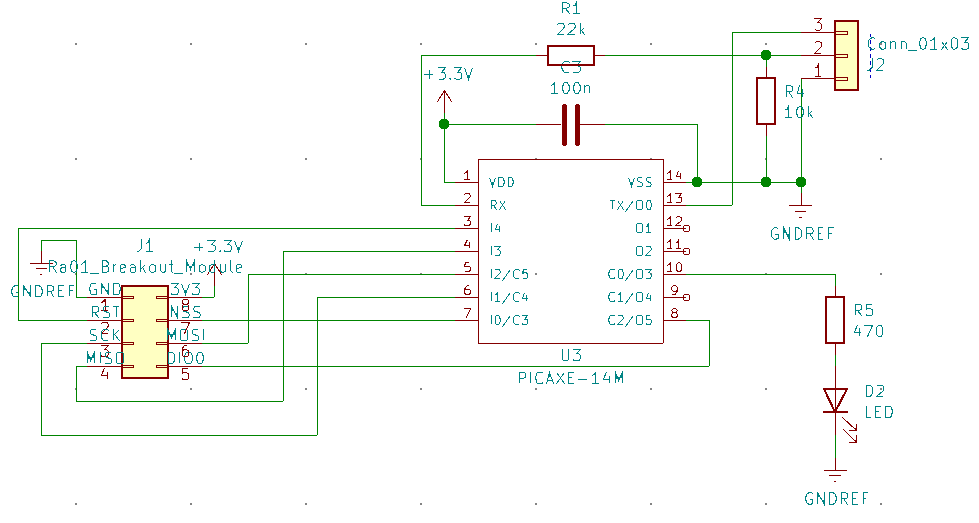

# LoRa and PJON
Adapted from the Arduino [LoRa](https://github.com/sandeepmistry/arduino-LoRa) and [PJON](https://github.com/gioblu/PJON) libraries.
These code modules allow the PICAXE microcontroller to bit bang Serial Peripheral Interface (SPI) to Semtech SX127* based LoRa radio modules.

PICAXE microcontrollers are well suited for small sensors that these radio modules might be used in. This is because they are relatively cheap, can be run from 3.3V, are quite low current with the ability for reducing power draw further and have ability to be quickly and relatively easily reprogrammed in the field, as well as not needing many peripheries to be able to run.

Either LoRa packets as sent from the Arduino LoRa library can be transmitted and recieved or they can be encoded and decoded from a limited implementation of the PJON protocol, to add addressing and extra error detection.

Most of this code has been tested to run on a 14m2 or 18m2 with an Ra-01 module built around an SX1278 chip.

# Table of contents
- [LoRa and PJON](#lora-and-pjon)
- [Table of contents](#table-of-contents)
- [General code layout](#general-code-layout)
- [Configuration and Getting Started](#configuration-and-getting-started)
  - [Files to copy](#files-to-copy)
  - [Generating generated.basinc](#generating-generatedbasinc)
  - [Including the required files in your code](#including-the-required-files-in-your-code)
  - [Initialising the radio module](#initialising-the-radio-module)
  - [Setting the transmit power](#setting-the-transmit-power)
  - [Sending a LoRa packet](#sending-a-lora-packet)
  - [Receiving a LoRa packet](#receiving-a-lora-packet)
  - [Sending a PJON packet](#sending-a-pjon-packet)
  - [Receiving a PJON packet](#receiving-a-pjon-packet)
  - [Getting received RSSI and SNR values](#getting-received-rssi-and-snr-values)
  - [Power modes](#power-modes)
- [Hardware and Connections](#hardware-and-connections)
- [Limitations](#limitations)
  - [Overall](#overall)
  - [LoRa](#lora)
  - [PJON](#pjon)
- [Examples](#examples)
  - [Transmit.bas](#transmitbas)
  - [Receive.bas](#receivebas)
  - [PJONReceive.bas](#pjonreceivebas)
  - [BatteryVoltsMonitor.bas](#batteryvoltsmonitorbas)
- [Other code and info for using LoRa modules with PICAXE uCs](#other-code-and-info-for-using-lora-modules-with-picaxe-ucs)


# General code layout
The code for talking to the module is in [LoRa.basinc](include/LoRa.basinc). The code for dealing with PJON is in [PJON.basinc](include/PJON.basinc). Symbols and constants that might be needed globally are in [symbols.basinc](include/symbols.basinc) and [generated.basinc](include/generated.basinc).

Parameters are passed to most subroutines using the bytes `param1` and `param2`, although sometimes `rtrn` is used if a word is required.

Values are generally returned from sub routines using `rtrn`.

Many subroutines have what variables are modified by them or the subroutines they call in a comment up the top. This might be useful if weird things are happing as most convenient to use named variables (`b0, b1, ...`) are used during certain subroutines. No variables are required to store data between calling subroutines at the main program level, so they can be modified and used. Just expect them to change if a LoRa or PJON subroutine is called.

# Configuration and Getting Started
## Files to copy
Copy all of the [include](include) folder into your project folder.

## Generating [generated.basinc](include/generated.basinc)
Due to issues with program size and 32 bit maths, the spreading factor, frequency and ldo flag bytes need to be calculated before the program is uploaded to the microcontroller. This can be done with the python script [calculations.py](include/calculations.py) found in the include folder. Simply run this script from the include folder and follow the prompts to enter the frequency and spreading factor. If generated.basinc is placed somewhere else, copy and paste it into the include folder.

## Including the required files in your code
To include these modules, add these lines to the top of the main file.
```basic
#INCLUDE "include/symbols.basinc"
#INCLUDE "include/generated.basinc"

' Uncomment / comment out these according to what functionality is required.
#DEFINE ENABLE_LORA_RECEIVE
#DEFINE ENABLE_PJON_RECEIVE
' #DEFINE ENABLE_LORA_TRANSMIT
' #DEFINE ENABLE_PJON_TRANSMIT
```
To send / receive using PJON, the corresponding send / receive LoRa define must be present.

At the bottom of the file, include these lines:
```basic
' Libraries that will not be run first thing.
#INCLUDE "include/LoRa.basinc"
#INCLUDE "include/PJON.basinc"
```
[PJON.basinc](include/PJON.basinc) does not need to be included if it is not required. Make sure to use `end`, `stop` or an endless loop such as `goto main` to makes sure that the PICAXE does not run off the bottom of the main file into these files.

## Initialising the radio module
This code was designed and tested with the PICAXE running at 32MHz.
```basic
setfreq m32
```

The following will attempt to initialise the module. `rtrn` will be `0` on failure and `1` for success.
```basic
' Attempt to start the module
gosub begin_lora
if rtrn = 0 then
    sertxd("Failed to start LoRa", cr, lf)
    goto failed ' Endless loop and flashing an LED
else
    sertxd("LoRa Started", cr, lf)
endif
```

Next, the spread factor needs to be set to what was [defined](#generating-generatedbasinc) in [generated.basinc](include/generated.basinc).
```basic
gosub set_spreading_factor
```

## Setting the transmit power
By default, the transmit power is initialised to +17dBm, the same as with the Arduino LoRa library. This can be changed after initialisation by setting `param1` to be the new power in dBm and calling `set_tx_power`.
```basic
param1 = 17
gosub set_tx_power
```

Make sure to double check local regulations in regard to output power, frequencies allowed and transmission times.

## Sending a LoRa packet
Start by copying the packet contents into general ram and set `bptr` to point to the first byte.
```basic
eeprom 0, ("Hello world")

bptr = 28
for counter2 = 0 to 10
	read counter2, @bptrinc
next counter2

bptr = 28 ' Point back to the fist byte
```
Begin a packet and set up the registers in the module ready to transmit.
```basic
gosub begin_lora_packet
```
Set `param1` to the length of the packet. This must be after calling `begin_lora_packet`.
```basic
param1 = 11
```

Next, call `write_lora` to send the data stored in the PICAXE's ram to the buffer in the module.
```basic
gosub write_lora
```

Finally, call `end_lora_packet` to tell the module to send the packet and wait until it is done. If the packet sent successfully, `rtrn` will be `1`. Sometimes the connection to the module may not be the most reliable and a timeout is implemented to stop the PICAXE getting stuck forever. In this case, `rtrn` will be `0`.
```basic
gosub end_lora_packet
if rtrn = 0 then
    ' Something went wrong. Attempt to reinitialise the radio module.
    sertxd("LoRa dropped out.", cr, lf)
endif
```

## Receiving a LoRa packet
Before any packet can be received, the module must be put into listening mode. This increases the current draw quite dramatically - see the [Power Modes](#power-modes) section for more details.
```basic
gosub setup_lora_receive
```

Check the status of the `DIO0` pin using the `LORA_RECEIVED` macro. If this is true, then a packet has been received and it should be processed. Call `setup_lora_read` to start this process.
```basic
if LORA_RECEIVED then
    gosub setup_lora_read
    ...
```

A packet is valid if, after calling `setup_lora_read`, `rtrn` is not `LORA_RECEIVED_CRC_ERROR`. If it is valid, `rtrn` will contain the received packet length.
```basic
    ...
    if rtrn != LORA_RECEIVED_CRC_ERROR then
        ' Do stuff with the received packet
    endif
endif
```

The packet contents can be obtained by calling `read_lora`. Each time `read_lora` is called, the next byte will be returned in `rtrn`.
```basic
for total_length = total_length to 1 step -1
    gosub read_lora
    sertxd(rtrn)
next total_length
```

## Sending a PJON packet
The process for sending a PJON packet is similar to sending a standared LoRa packet, except with calls to different subroutines.

Start by calling `begin_pjon_packet` to set `bptr` to the correct starting location.
```basic
gosub begin_pjon_packet
```

Now, `@bptrinc` can be used to load the data into the correct location in ram.
```basic
' This is an example. Use a for loop or something better in actual practise
@bptrinc = "H"
@bptrinc = "e"
@bptrinc = "l"
@bptrinc = "l"
@bptrinc = "o"
@bptrinc = " "
@bptrinc = "W"
@bptrinc = "o"
@bptrinc = "r"
@bptrinc = "l"
@bptrinc = "d"
```

Set `param1` to be the address that the packet should be sent to. Address 0 is a broadcast to everything else on the network.
```basic
param1 = 255
```

The packet can be finalised, checksums calculated, headers added and the packet sent by calling `end_pjon_packet`. If the packet is sent successfully, `rtrn = 1`, else `rtrn = 0`. 
```basic
gosub end_pjon_packet
if rtrn = 0 then
    ' Something went wrong. Attempt to reinitialise the radio module.
    sertxd("LoRa dropped out.", cr, lf)
endif
```

## Receiving a PJON packet
Before any packet can be received, the module must be put into listening mode. This increases the current draw quite dramatically - see the [Power Modes](#power-modes) section for more details.
```basic
gosub setup_lora_receive
```

Check the status of the `DIO0` pin using the `LORA_RECEIVED` macro. If this is true, then a packet has been received and it should be processed. Call `read_pjon_packet` to start this process. If the packet is valid, addressed to us and meets the checksum, the `rtrn` will contain the length of the packet payload. Otherwise, `rtrn = PJON_INVALID_PACKET`.
```basic
gosub read_pjon_packet
if rtrn != PJON_INVALID_PACKET then
    ...
```

The sender id is contained in `param1`. If the sender id was not included, `param1 = 0`.

To access the payload, use `@bptrinc`. `bptr` points to the first byte in the payload after calling `read_pjon_packet` and it returned a success.
```basic
for rtrn = rtrn to 1 step -1
	sertxd(#@bptrinc,", ")
next total_length
```

## Getting received RSSI and SNR values
The RSSI of a received packet can be obtained by calling `packet_rssi`. The RSSI is returned as a 2's compliment integer in dBm.
```basic
gosub packet_rssi
' rtrn = rssi in 2's complement
gosub print_signed ' Extra freebe to show how to interpret it.

print_signed:
	' Prints the value stored in rtrn as a 2s complement signed integer
	tmpwd = rtrn & 0x8000
	if tmpwd != 0 then
		; Negative
		sertxd("-")
		tmpwd = rtrn ^ 0xffff + 1 ' Convert to positive
		sertxd(#tmpwd)
	else
		sertxd(#rtrn)
	endif
	return
```

The signal to noise ratio of a received packet can be obtained using `packet_snr`. After calling this, `rtrn` will be the signal to noise ratio in 2's complement multiplied by 4 (to allow > whole number accuracy).
```basic
gosub packet_snr

' Note: I can't remember if there is a bug in this printing bit.
tmpwd = rtrn % 4 * 5 / 2 ; First digit after decimal point
rtrn = rtrn / 4
sertxd(cr,lf,"  - SNR: ")
gosub print_signed
sertxd(".",#tmpwd,cr,lf)
```

## Power modes
The LoRa modules have several different power modes and features available in each of them. Using a multimeter measuring current to the entire circuit, including an MIC2954 linear regulator dropping from 18V, I measured:
| LoRa Module Mode    | Picaxe Mode                      | Current draw     |
| ------------------- | -------------------------------- | ---------------- |
| Idle                | 32MHz                            | 4.95mA           |
| Sleep               | 32MHz                            | 3.16mA           |
| Sleep               | nap, brownout detection disabled | 0.18mA to 0.25mA |
| Receiving           | 32MHz                            | 14mA             |
| During transmission | 32MHz                            | ~150mA           |

My understanding is that idle allows use of the First In, First Out (FIFO) buffer in the module, while sleep clears it and doesn't let it be accessed or written to. This could be wrong though.

Subroutines that require it will automatically put the module in idle mode, but if needed somewhere else, use:
```basic
gosub idle_lora
```

To enter sleep mode:
```basic
gosub sleep_lora
```

To enter receiving mode:
```basic
gosub setup_lora_receive
```

# Hardware and Connections
The connections are defined in [symbols.basic](include/symbols.basinc). Pretty much any GPIO pins can be used. `MISO` and `DIO0` are inputs, everything else are outputs.

The schematic below shows the connections as originally given in [symbols.basic](include/symbols.basinc), including an LED and the programming header.


# Limitations
## Overall
- Both libraries use a fairly significant number of variables. Most subroutines should have which ones are modified by them or any subroutines that they call as a guide, but they may not be up to date or missing.
- This takes up a significant amount of the available program memory, so there is not that much left for the code that drives this code.

## LoRa
- As the SPI connection to the module is bit banged, it blocks any other code from running while talking to the module.
- When running at 32MHz, the clock speed is about 1.58kHz. For context, the radio module is rated to 10MHz and Arduino Unos drive it at 8MHz by default, meaning fairly slow setup and data transfer.
- Certain values must be calculated before the program is sent to the chip and cannot be changed at runtime. These include the frequency and spreading factor.
- Currently the `DIO0` pin on the radio module is used to detect when a packet is received, requiring an extra input pin on the PICAXE. This is due to the slow speed of the SPI bus and amount of time that would be spent checking registers otherwise, although feel free to implement that version as well.
- Explicit header mode only is supported. This means that spread factor 6 is also not supported due to its reliance on implicit header mode. Personally, I have found spread factor 9 to be one of the better settings in terms of received RSSI.
- Certain other configurations such as changing RF power pins are not supported.

## PJON
- Currently, only local mode is supported (no bus id).
- There is no queue of packets. It is assumed a packet will be processed as it is received and the `end_pjon_packet` subtroutine will block any other code running until the packet is sent.
- All packets are sent with a CRC32 checksum, regardless of length. It would probably be fairly easy to implement automatic selection of checksums based on packet length. When receiving, both CRC8 and CRC32 checksums are accepted.
- The sender id will always be sent.

# Examples
## [Transmit.bas](Transmit.bas)
This is a simple example demonstrating transmission of raw LoRa packets that initialises the module and repeatedly sends "Hello World" once every few seconds.

## [Receive.bas](Receive.bas)
This is a simple example demonstrating receiving of raw LoRa packets. This initialises the module and prints information about any packet it receives to the serial port.

## [PJONReceive.bas](PJONReceive.bas)
This example demonstrates the use of the PJON module to receive and print PJON formatted packets to the serial port.

## [BatteryVoltsMonitor.bas](BatteryVoltsMonitor.bas)
This is a project of mine using these modules. It can be found [here](https://github.com/jgOhYeah/Farm-PJON-LoRa-network)

# Other code and info for using LoRa modules with PICAXE uCs
- [HABAXE](https://picaxeforum.co.uk/threads/habaxe2-a-lora-based-high-altitude-balloon-tracker-project.26699/) is a High Altitude Baloon tracker built around x2 series chips and SX1278 based radio modules. It can also use them to transmit FSK modulated data as well as LoRa.
- This [PICAXE forum thread](https://picaxeforum.co.uk/threads/sx126x-lora-modules.31380/) discusses the use of SX12**6*** based LoRa modules, which can communicate over UART, making them much simpler to drive for a PICAXE, as well as having some better specs and features.