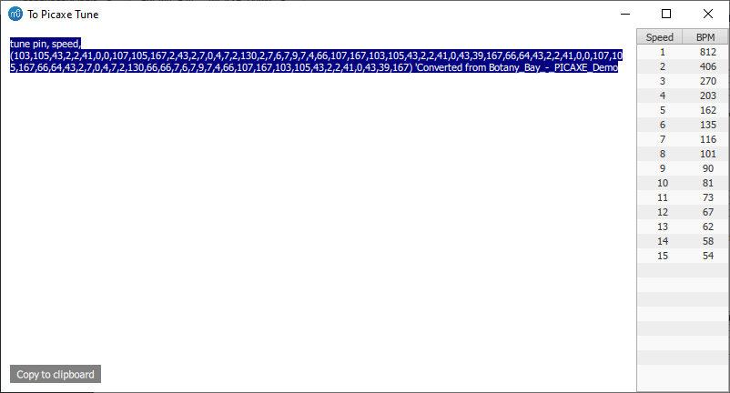

# PICAXE Tune converter
A small Musescore 3 plugin to convert simple tunes into code that can be used by the PICAXE tune command.
This is VERY buggy and may or may not work, but I found it useful.
(Be warned, I didn't really know what I was doing or much about qml when I wrote this - No comment about what I know or don't know about it now :) )

## To use:
1. Copy this file into the Musecore plugins folder (In Windows, this is User's Folder\Documents\Musescore3\plugins)
2. In Musecore, go to Plugins > Plugin manager and tick the box next to this file to display it in the Plugins menu.
3. Open the file you want to convert. Ideally, it should only have a single stave and one note at a time. Things that PICAXE microchips do not support such as dotted notes and ties should be edited out.
4. Make sure that nothing is selected as there seems to be a bit of a bug in how it is handled in the code somewhere.
5. Go to Plugins > the name of this file to run it. There should be a box popup with the tune. Click copy to clipboard.
6. Paste the code in the Picaxe editor document. Replace "pin" with the pin to use (see the manual for pins available on each chip) and "speed" with the code for the closest speed (see the manual or the table on the popup window).

## Tips:
- If there are short notes or more complex timings required, it may be helpful to write the song in Musescore with each note taking up double the number of beats it would normally, then setting a faster time to play in the PICAXE chip.
- If there are random notes or rests added, double check there is not more than one note played at a time.
- Depending on versions of Musescore and bugginess of this script, the plugin may not run correctly when started from the plugins dropown menu. Instead, you might have to open this file in the plugin creator and click run in the bottom left of it.
- It may be helpful if you are struggling to get timings that the PICAXE supports to put everything in one massive bar so that you do not have to worry about things like 2 minims (1/2 notes) tied together over a bar line and can instead use a semibreve (whole note).
- Repeats and jumps are ignored. If you need them, copy everything out in a linear fashion.

## What it should look like

If it doesn't look vaguely like this on your computer, then try running it through the plugin creator in Musescore.

Written by Jotham Gates. Some stuff is copied from various example plugins.